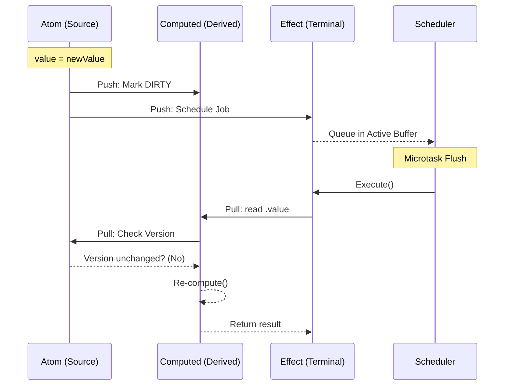

# Architecture & Design

This document provides a formal overview of the internal architecture of `@but212/atom-effect`. It details the structural patterns, reactive principles, and performance-critical implementations that drive the core engine.

---

## 0. Glossary of Terms

To ensure technical clarity, the following definitions are used throughout the system:

- **Reactive Node**: The atomic unit of the dependency graph (Atom, Computed, or Effect).
- **Epoch**: A monotonically increasing global counter used to track logical time across the system. Used for job deduplication and session validation.
- **Version**: A node-specific counter that increments only when the node's output value changes.
- **Drift**: A state where a subscriber's cached version of a dependency no longer matches the dependency's current version.
- **Glitch**: A transient inconsistency in the graph where a node observes intermediate or stale state during a propagation cycle.
- **SVO (Small Vector Optimization)**: A memory management technique using inline slots to avoid heap allocations for small collections.

---

## 1. System Architecture: The Push-Pull Hybrid

The engine utilizes a hybrid notification and evaluation model to balance update responsiveness with computation efficiency.

### Propagation Lifecycle

1. **Notification (Push)**: A mutation in a source **Atom** triggers a breadth-first propagation of "dirty" signals to immediate subscribers.
    - **Computed Nodes**: Marked as `DIRTY`.
    - **Effects**: Scheduled in the **ReactiveScheduler**.
2. **Scheduling (Batching)**: Notifications are coalesced within a microtask. Multiple updates to the same source or related sources result in a single execution pass for downstream nodes.
3. **Validation (Pull)**: When a node is accessed or an effect executes, it validates its dependencies.
    - **Re-computation**: Only occurs if a dependency's **Version** has incremented.
    - **Short-circuit**: If a dependency re-evaluates but produces an identical result (version unchanged), the pull phase terminates early.

### Sequence Visualization

---

## 2. Component Architecture

### Class Hierarchy & Dual-Layer Encapsulation

The system employs a dual-layer encapsulation model designed for both V8 JIT optimization and API safety.

- **`ReactiveNode<T>`**: The foundation interface ensuring monomorphic property access across the engine.
- **Public Engine Fields**: Properties required for graph traversal (`flags`, `version`, `_storage`) are public. This ensures V8 generates stable **Hidden Classes** with direct property access, bypassing getter/setter overhead in hot paths.
- **Private Behavioral State**: Value storage (`#value`), computation logic (`#fn`), and budget states use **native private fields (`#`)**. This protects internal invariants and prevents external tampering.

### Node Roles

| Role | Implementation | Input | Output | Characteristic |
| :--- | :--- | :--- | :--- | :--- |
| **Source** | `AtomImpl` | Manual | State | Leaf node, non-tracking. |
| **Transform** | `ComputedImpl` | Reactive | State | Hybrid node, lazy, cached. |
| **Sink** | `EffectImpl` | Reactive | Void | Terminal node, side-effects. |

---

## 3. Performance & Optimization

### V8-Optimized Memory Layout

1. **SMI (Small Integer) Safeguards**: All counters (Epoch, Version, ID) are bit-masked to 31 bits to ensure they remain within the SMI range, avoiding heap-allocated `HeapNumber` transitions.
2. **SlotBuffer (SVO)**: Subscriber and dependency lists use `#s0`–`#s3` inline slots. This avoids array allocation for the majority of nodes that have fewer than 4 connections.
3. **Bitwise Partitioning**: Node state is packed into a single 31-bit integer. Offsets (Core, Computed, Async, Primitive) allow atomic state checks and transitions via bitwise masks.

### Subscription Reconciliation

During re-computation, the engine performs **Link Swapping**. It compares new dependencies against the previous run's buffer. By swapping active links to the front and truncating the remainder, it avoids the high cost of tearing down and re-establishing listener relationships for stable dependencies.

---

## 4. Async Boundary Integrity

Asynchronous computations are treated as state machines.

- **Session Locking**: A rolling session ID ensures that only the result from the *most recent* asynchronous trigger can resolve the node. Results from previous, now-stale sessions are discarded.
- **Synchronous Tracking Boundary**: Tracking is strictly synchronous. Dependencies accessed after an `await` are not captured because the tracking context is cleared when the function yields. This design choice ensures deterministic tracking and prevents memory leaks from accidentally long-lived tracking sessions.

---

## 5. Security & Stability

### Circularity & Infinite Loops

- **Circular Detection**: The `RECOMPUTING` flag identifies nodes that are accessed during their own derivation pass, throwing a `ComputedError`.
- **Execution Budgets**: Effects have a mandatory `maxExecutionsPerFlush` (default 100) to prevent runaway reactive loops from hanging the main thread.

### Prototype Integrity

Lenses utilize a prototype-preserving clone-and-set mechanism. Updates to nested properties of class instances preserve `instanceof` relationships and access to class methods, ensuring structural integrity across the reactive boundary.

---

## 6. Design Trade-offs

1. **Memory vs. Diagnostic Metadata**: Debug names and IDs are non-enumerable symbols. While this increases object header size slightly, it provides essential observability for complex dependency graphs.
2. **Sync Tracking vs. Async Support**: By not tracking dependencies after `await`, the library prioritizes predictability and performance. Users must ensure all reactive sources are accessed before the first asynchronous yield.
3. **Class-based implementation**: Choosing classes over closures for internal nodes allows for better monomorphic optimization in V8 but requires more disciplined state management.
