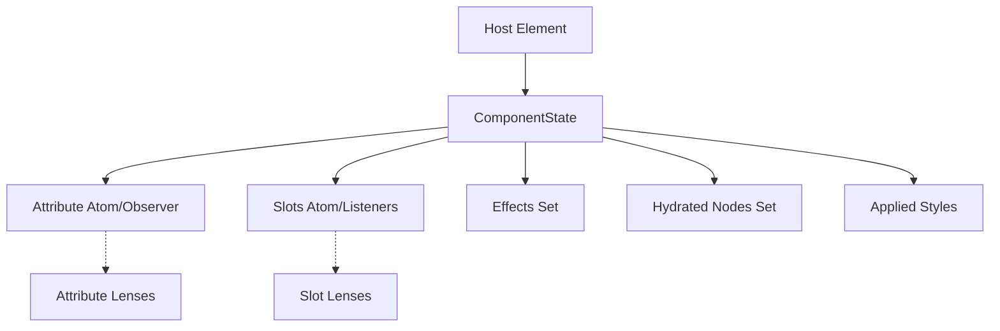
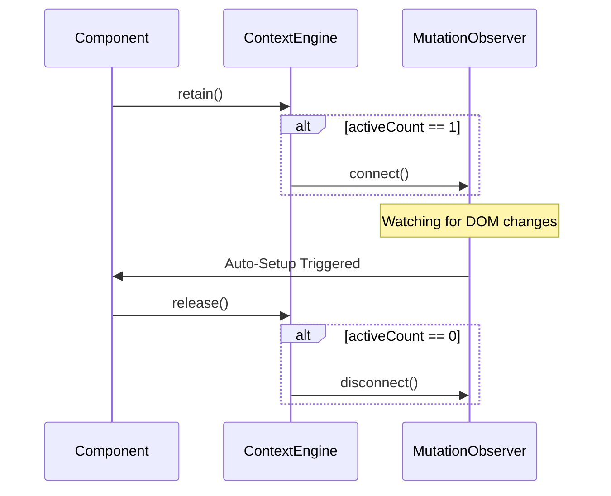

# Architecture & Design

This document explains the internal mechanics of `@but212/atom-effect-jquery`. It is intended for developers who want to understand the jQuery integration layer or contribute to the package.

## 1. Overview

The jQuery package provides a reactive binding layer on top of `@but212/atom-effect` core. It bridges reactive primitives to the DOM via jQuery.

```text
                 ┌───────────────────────────────────┐
                 │       @but212/atom-effect         │
                 │  atom / computed / effect / batch │
                 └──────────────┬────────────────────┘
                                │
                 ┌──────────────▼────────────────────┐
                 │    @but212/atom-effect-jquery     │
                 │                                   │
                 │  unified.ts   ← Binding handlers  │
                 │  effect-factory.ts ← Effect reg.  │
                 │  registry.ts  ← Lifecycle mgmt    │
                 │  jquery-patch.ts ← jQuery patches │
                 │  chainable.ts ← $.fn methods      │
                 │  bindings/list/ ← Modular list    │
                 │  route.ts     ← SPA router        │
                 │  mount.ts     ← Component mount   │
                 │  core/dom.ts  ← Core DOM engine   │
                 └───────────────────────────────────┘
```

## 2. Binding Pipeline

Every reactive binding follows a standardized pipeline:

```text
$.fn.atomText(atom)
  → chainable.ts (jQuery method)
    → unified.ts: bindText(el, atom)
      → effect-factory.ts: registerReactiveEffect(el, source, updater)
        → core: effect(() => { updater(source.value) })
        → registry.trackEffect(el, effectInstance)
```

### 2.1 Effect Factory

`registerReactiveEffect` and `registerMapEffect` (`effect-factory.ts`) utilize a shared `createAsyncRunner` utility to manage reactive updates. This internal helper encapsulates:

- **Async Resolution**: Handles `Promise` values from any source.
- **Race Condition Protection**: Uses a monotonic `latestId` to ensure only the result of the most recent async operation is applied to the DOM.
- **Disposal Tracking**: Automatically tracks disposal state via `registry.trackCleanup`, ensuring stale async results are discarded if the element is disconnected during resolution.
- **Monomorphic Updates**: Ensures updaters are executed inside an `untracked` block to isolate reactive dependencies.

### 2.2 DOM Engine

`atomEachElement(jq, fn)` in `core/dom.ts` provides the iteration engine for reactive bindings. It handles jQuery sets, filters for `HTMLElement`, and utilizes optimized loops to manage performance in critical paths.

Internal binding handlers in `unified.ts` operate on native `HTMLElement` references, utilizing jQuery for event delegation or multi-event management (e.g., in `bindEvents`).

### 2.3 Unified Binding (`atomBind`)

`atomBind` dispatches to specific handler functions:

```text
atomBind({ text, html, class, css, attr, prop, show, hide, val, checked, on })
  → bindText, bindHtml, bindClass, bindCss, bindAttr, bindProp,
    bindVisibility, bindVal, bindChecked, bindEvents
```

Handlers are standalone functions, which facilitates tree-shaking and reduces cyclomatic complexity.

#### 2.3.1 Performance Implementation Details

To manage performance during high-frequency updates, `unified.ts` implements several techniques:

- **Metadata Caching**: Bindings such as `atomClass`, `atomCss`, `atomAttr`, and `atomProp` pre-calculate metadata during initial registration. Map objects are hoisted outside the iteration loop to reduce allocations.
- **Monomorphic Dispatch**: The `InputBinding` class specializes its logic at construction time, removing branching from synchronization paths.
- **JS-Level Value Caching**: Handlers maintain a local cache of the last written value to avoid redundant DOM reads and writes.
- **Batched Map Updates**: `registerMapEffect` processes dictionaries of reactive values in a single effect to improve subscription efficiency.
- **Async Consolidation**: `registerMapEffect` uses `Promise.all` to synchronize multiple asynchronous dependencies within a map.

## 3. Lifecycle Management

### 3.1 Binding Registry

The `BindingRegistry` (`registry.ts`) manages the lifecycle of effects and cleanup functions. Storage uses a centralized `WeakMap` (`nodeStateMap`) to prevent memory leaks. Resource pooling is omitted to maintain architectural simplicity, as modern JS engines optimize the allocation of these state objects.

### 3.2 Marker Class Optimization

Bound elements are marked with an `_aes-bound` CSS class. This allows the registry to identify elements for cleanup using `querySelectorAll`, which provides a static NodeList snapshot and avoids issues with live collections.

### 3.3 Auto-Cleanup via MutationObserver

`enableAutoCleanup(root)` installs a `MutationObserver` on the specified root to watch for removed nodes. For the global DOM, this is lazily initialized. The logic handles early initialization cases where the document body is not yet ready.

#### 3.3.1 Move Robustness (Deferred Cleanup)

Synchronous DOM moves are supported via **Deferred Cleanup** in `registry.deferCleanup(node)`.

- Disconnected elements are marked and a cleanup task is queued as a microtask.
- If re-connected before the microtask runs, the cleanup is cancelled.
- This preserves reactive state during repositioning operations.

### 3.4 Shadow DOM

The global `MutationObserver` does not cross Shadow DOM boundaries. AEJ provides Shadow DOM support through:

- **Host Marking**: Hosts are marked with an `_aes-has-shadow` class during initialization.
- **Traversal Logic**: `cleanupTree` uses these markers to identify shadow hosts, avoiding full-tree scans.
- **Closed Shadow Support**: Maintains a `WeakMap` of hosts to `ShadowRoot` objects for cleaning inaccessible subtrees.
- **Scoped Observers**: `useAtomComponent` attaches observers to the component's root.

### 3.5 jQuery Method Patches

`enablejQueryOverrides()` patches core jQuery methods to integrate with the reactive lifecycle:

| Method | Patch Behavior |
| ------ | -------------- |
| `.remove()` | Calls `cleanupTree` before removal. |
| `.empty()` | Calls `cleanupDescendants` before emptying. |
| `.detach()` | Marks elements as preserved to maintain bindings. |
| `.on()` | Wraps handlers in `batch()` for update coalescing. |
| `.off()` | Resolves wrapped handlers via `WeakMap`. |

The `.on()` patch ensures that multiple atom writes within a single event handler are batched into a single synchronous flush.

## 4. Two-Way Input Binding

`applyInputBinding` implements two-way binding with the following features:

- **Strategy Specialization**: Selects optimized logic at initialization based on element type.
- **Cursor Preservation**: Uses a selection-range buffer to prevent cursor shifting during reactive updates.
- **Cycle Prevention**: A bitmask-based state gate ensures uni-directional synchronization.
- **IME & Composition**: Defers updates during composition until strings are finalized.

## 5. List Reconciliation

`atomList` renders reactive arrays using a 3-pass reconciliation algorithm:

1. **Prefix/Suffix Trimming**: Skips common items at the start and end of the list.
2. **Middle Diffing**: Reconciles the middle range using bitwise state flags and key mapping.
3. **Patching**: Synchronizes the DOM using a greedy placement strategy and native DOM APIs to bypass jQuery overhead.
4. **Initial Render**: Uses bulk-sanitized fragments where possible to optimize hydration.

### 5.1 Reconciliation Lifecycle

The reconciliation process is modularized into `diff.ts` (calculation), `dom.ts` (manipulation), and `context.ts` (state management). Lifecycle hooks such as `render`, `bind`, and `update` allow for customized behavior.

### 5.2 Delegated Event Listeners

Event listeners are attached to the container rather than individual items, maintaining constant memory usage regardless of list size.

## 6. Component Mounting

`atomMount` provides a component lifecycle with automatic cleanup and batched execution. Setup logic is isolated within `untracked()` blocks to prevent subscription leaks, and errors are caught to ensure application stability.

## 7. SPA Router

The router utilizes reactive states for navigation management.

### 7.1 Mode Abstraction (`UrlAdapter`)

Decouples browser navigation using the `UrlAdapter` strategy pattern, allowing for both hash-based and History API modes.

### 7.2 Transition Lifecycle

Navigation follows a defined pipeline: Link Interception -> Leave Guards -> Browser Sync -> Enter Guards -> State Update -> DOM Render -> Accessibility Finalization.

### 7.3 Performance & Resilience

Includes a resolution cache for route links and centralized path utilities for string manipulation. Asset links are automatically ignored to prevent interference with file downloads.

## 8. Reactive Data Fetching (`$.atomFetch`)

`$.atomFetch` provides a declarative AJAX primitive that integrates `$.ajax` with computed atoms.

- **Lifecycle Management**: Uses `AbortController` for cancellation and disposal.
- **Error Handling**: Standardizes error instances and isolates user hooks to prevent breaking the reactive chain.
- **Abort Silence**: Catch and ignore `AbortError` internally during rapid re-evaluations.

## 9. Security

The binding layer includes several defensive measures:

- **Sanitization**: Uses a recursive DOM-based sanitizer that transforms untrusted tags into inert wrappers.
- **DOM Clobbering Protection**: element interactions are routed through prototype-level descriptors.
- **Attribute & Sink Protection**: Blocks `on*` event handlers and monitors sensitive sinks like `srcdoc`.
- **CSS Validation**: Blocks CSS values containing untrusted patterns.

## 10. Module Structure

The package is organized into core logic, binding handlers, features (Routing, Fetching, Navigation), and utilities (Debugging, Sanitization).

## 11. PJAX Navigation (`$.atomNav`)

`$.atomNav` treats the browser's URL as a reactive atom and manages metadata and attribute synchronization during navigation.

- **Race Condition Safety**: Uses `AbortController` to manage the navigation lifecycle and prevent stale updates.
- **Transitions**: Optimizes navigation paths by ignoring redundant requests and bypassing hooks for hash-only transitions.

## 12. Performance & Memory Management

### 12.1 Internal Data Structures

Internal state records are initialized with a fixed set of fields to maintain monomorphic shapes, allowing for efficient property access in JS engines.

### 12.2 Branching Optimizations

The library minimizes branching in performance-critical paths through task-based dispatch in `atomBind` and strategy specialization in `InputBinding`. Static snapshots are used during registry cleanup to stabilize loop prediction.

### 13. Lenses & Structural Sharing

Lenses are re-exported from the core package. `atomForm` leverages these for deep property binding while maintaining performance through leaf atoms and a centralized dispatcher. It also integrates with the browser's **Constraint Validation API**, reactively calling `setCustomValidity` on form controls based on the provided validation schema.

## 14. Debugging & Visual Highlighting

The `DebugController` provides visual feedback via non-blocking outlines using `requestAnimationFrame`. Selector logic generates human-readable identifier strings for elements in logs.

## 15. Web Component & DI Integration

### 15.1 Web Component Controller (`ComponentState`)

`useAtomComponent(element)` implements a composition-based model managed by the `ComponentState` class. This internal state centralizes all reactive resources and manages the initialization of declarative specs.

- **ComponentState**: Encapsulates all reactive resources for a single component instance, including lenses, effects, and mutation observers.
- **Reasoning**: By consolidating lifecycle resources into a single class instance, the library ensures deterministic disposal during `teardown()` and prevents memory leaks that typically arise from fragmented observer management.

#### Internal Resource Management



### 15.2 Declarative Synthesis & Features (`SetupFeatures`)

The `setup()` method delegates specific activations to the `SetupFeatures` module. This decomposition allows for feature-specific optimization without polluting the main controller logic.

- **Dynamic Hydration**: Uses a dedicated `MutationObserver` per component to ensure that both static and dynamically injected nodes (containing `data-aej-bind`) are correctly bound to reactive state.
- **FACE Integration**: Leverages `ElementInternals` to bridge AEJ atoms with the browser's native form submission and validation engines.

### 15.3 Context Engine & Auto-Setup

The `ContextEngine` is a singleton that manages global DOM observation and reactive context versioning. It utilizes a **Reference Counting (`retain`/`release`)** mechanism to optimize performance.

#### Global Observer Lifecycle



- **Logic: Just-in-Time Observation**: The global `MutationObserver` is only active when there are "offline" components (created but not yet connected) or active context injections. This minimizes the performance impact on the main thread during heavy DOM manipulations.

### 15.4 Form Integration (FACE)

`useAtomComponent` provides first-class support for **Form-Associated Custom Elements**. When `value` or `validation` options are provided to `setup()`, the controller uses `ElementInternals` to:

1. **Sync Values**: Serializes atom data (using `flattenToFormData` for complex objects) and passes it to `internals.setFormValue()`.
2. **Sync Validity**: Maps validation results to `internals.setValidity()`, allowing the custom element to block form submission and reflect `:invalid` states.

## 16. Testing & Quality

### 16.1 Modular Test Suite

To maintain the reliability of the complex integration layer, the test suite is partitioned into specialized categories located in `__tests__/integration/`:

- **`features/`**: Individual reactive binding behaviors (Async, SVG, Lists).
- **`synergy/`**: Cross-feature interactions (Web Components + DI).
- **`routing/`**: Navigation and path matching scenarios.
- **`core/`**: Lifecycle, batching, and DOM engine verification.
- **`scenarios/`**: End-to-end complex application logic.

This modularization prevents race conditions and ensures that environment failures (like Playwright Iframe timeouts) are easily pinpointed.

### 16.2 Runtime Diagnostics

The library implements proactive diagnostics to prevent "silent failures," particularly with Custom Elements:

- **Registration Checks**: In `debug` mode, `$.route`, `$.useAtomComponent`, and `$.injectAtom` automatically verify that custom element tags are registered in `customElements`.
- **Warning System**: Discovered issues are logged via `debug.warn` with the `[atom-component]` prefix to guide developers during initial setup.
